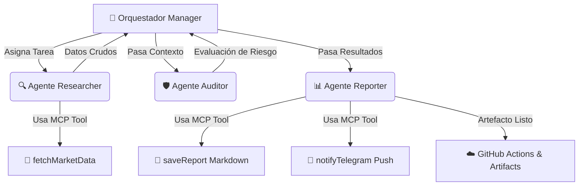

# 🤖 Autonomous Multi-Agent Swarm & Orchestration Pipeline


-purple?style=flat)
-blue?style=flat)


Sistema autónomo de orquestación **Multi-Agente (MAS)** inspirado en el estándar **Model Context Protocol (MCP)**. Implementa un patrón arquitectónico *Manager-Worker* donde un Agente Orquestador coordina subagentes especializados para recolección de datos, auditoría de riesgos y generación de reportes ejecutivos con alertas en tiempo real.

---

## 🏛️ Arquitectura del Sistema



---

## 👥 Especialización de los Subagentes

1. **Manager (Orquestador):** Controla el ciclo de vida del enjambre, gestiona la concurrencia y consolida las salidas.
2. **Data Scout & Researcher:** Interactúa con APIs públicas para obtener métricas dinámicas y estado en tiempo real.
3. **Risk & Quality Auditor:** Analiza variaciones, clasifica umbrales de riesgo (Alto/Medio/Bajo) y calcula tendencias.
4. **Executive Synthesizer & Dispatcher:** Compila informes estructurados en Markdown y despacha notificaciones push vía Telegram.

---

## 🛠️ Herramientas estilo MCP (Toolkit)

El sistema abstrae las capacidades externas en herramientas independientes:
- `fetchMarketData()`: Conexión con proveedores de datos en vivo.
- `saveReport()`: Persistencia de artefactos en el sistema de archivos.
- `notifyTelegram()`: Integración con webhooks y mensajería en la nube.

---

## 💻 Ejecución Local

1. Clonar el repositorio:
   ```bash
   git clone https://github.com/Slashmanlml/autonomous-agent-swarm.git
   cd autonomous-agent-swarm
   ```

2. Ejecutar el enjambre:
   ```bash
   node index.js
   ```

---

## ☁️ Despliegue en GitHub Actions

El enjambre se ejecuta automáticamente en la nube:
- **Disparador:** Tarea programada (Cron cada 12 horas), Push a `main`, o disparo manual (`workflow_dispatch`).
- **Persistencia:** Almacena los informes generados en la sección de **Artefactos (Artifacts)** y realiza commits automáticos al historial de Git.
